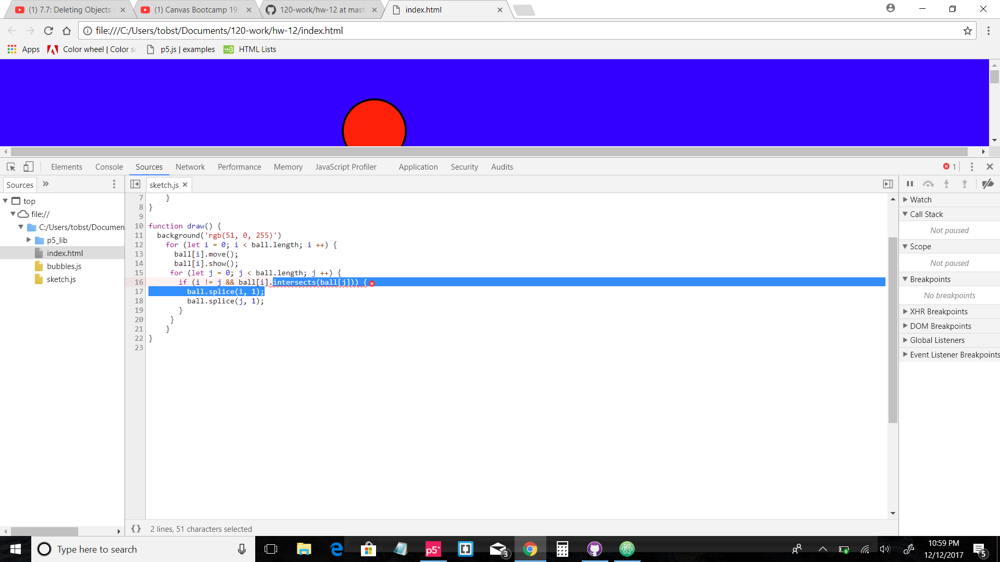

Tobin Long - 50

[Sketch](https://stuffnthingz.github.io/120-work/hw-12/)

# HW-12 RESPONSE

### Process this week:
I started out by taking an old homework assignment to use as a template. I updated
everything into a class and functions in a seperate javascript file and put it in
the html file. I found that really useful. I wanted to keep it as simple as possible, so I
made a bunch of random bouncing balls that were suppose to pop when they collided.
I used the intersects function with the splice function just like Dan Shiffman
did in his intersection tutorials. I've been working on it for almost two days now
and can't figure out why it freezes sometimes. I searched everywhere online for a solution,
including posting in the issues forum. Two students replied and I followed their instructions
with no luck. Maybe I should have started over, but I'm stubborn. I'm going to turn in
what I have now so I can get credit, and keep looking for answers.  Here is the
error message I kept getting:

