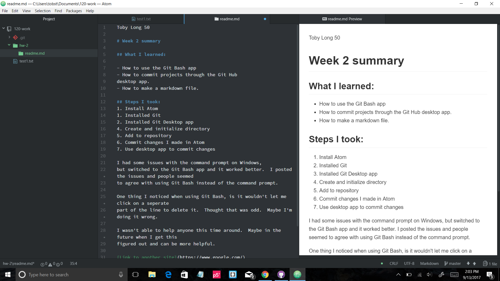

Toby Long 50

# Week 2 summary

## What I learned:

- How to use the Git Bash app
- How to commit projects through the Git Hub
desktop app.
- How to make a markdown file.

## Steps I took:
1. Install Atom
1. Installed Git
2. Installed Git Desktop app
4. Create and initialize directory
5. Add to repository
6. Commit changes I made in Atom
7. Use desktop app to commit changes

I had some issues with the command prompt on Windows,
but switched to the Git Bash app and it worked better.  I posted the issues and people seemed
to agree with using Git Bash instead of the command prompt.

One thing I noticed when using Git Bash, is it wouldn't let me click on a seperate
part of the line to delete it.  Thought that was odd.  Maybe I'm doing it wrong.

I wasn't able to help anyone this time around.  Maybe in the future when I get this
figured out and can be more helpful.

[Link to another site](https://www.google.com/)

```
This is me using backticks
```

