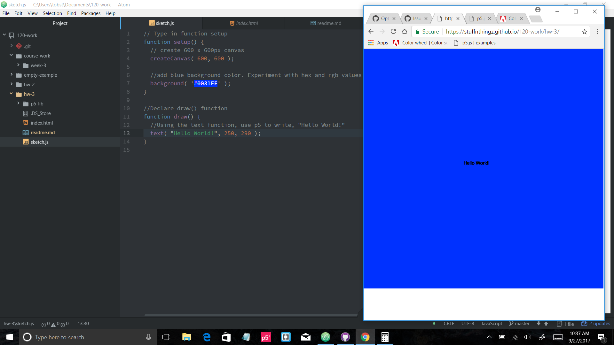

Tobin Long, 50

["Hello
World!"](https://stuffnthingz.github.io/120-work/hw-3/)

# HW-3 RESPONSE

This week I simply just followed the tutorials on the website. I made a
couple mistakes with saving files, so I had to backtrack a little to get
them fixed.

I have messed around with p5 a little so I was already a
little familiar with it. I found that the reference page on the p5 website
to be very helpful, especially when experimenting with colors.

I didn't run into any problems that I had to post in the issues forum,
most of the mistakes I made this week were just things like spelling or not having a file in
the right place. One thing I was curious about, is figuring out the size
of the text so you can get it perfectly centered on the canvas. Also, I put in a hex code for the color that is staying highlighed for some reason.  It works, but not sure why that is. I saw that someone had a question about the resolution for text on the html. I was curious about that as well, but I guess it's nothing to worry about.

Overall, I'm excited to get started with p5. It's really fun to  experiment with and see everything slowly come together.

## Final sketch

Notice the hex code highlighted???

